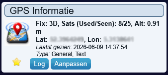

# Domoticz-GPSD-plugin

The idea for this plugin started when I made a small Raspberry Pi HAT with a GPS Module from one of the Chinese Warehouses. The initial goal of the GPS HAT was to serve accurate time to my home network using gpsd and chrony. This works perfectly, however I was missing a simple dashboard to view the status information of the gpsd daemon. Together with ChatGPT I created a plugin for Domoticz that creates a domoticz text device, and polls the gpsd.socket 2947 every 30 seconds, and presents the most relevant data to this device.

## Installation

To install:

- Go into the Domoticz plugins directory using a command line.
- Run: `git clone https://github.com/marceldbo/Domoticz-GPSD-plugin.git`
- Restart Domoticz.

To update:

- From the Domoticz plugins directory, using a command line, go into the Domoticz-GPSD-plugin directory.
- Run: `git pull`
- Restart Domoticz.

## Configuration and additional notes

- Check if the plugin file is executable `ls -al`. If not, do `sudo chmod 755 plugin.py`.
- Check that the `gpsd.sock` in `/var/run` is readable for all users. If not, change the permissions as follows `sudo chmod 666 gpsd.sock`.
- Now stop and start the domoticz service.
- The plugin should be selectable under the `Hardware tab`. Look for `GPSD Status Monitor`.
- Before configuring, make sure that Domoticz accepts new devices.
- Configure the plugin.
- A new GPS device should be available under the `Devices tab`.

For convenience, I have also generated and included an icon to be used with the newly created device. This can be installed by uploading the `Gpsd.zip` file in the custom icons section in the Domoticz GUI and updating the device.
